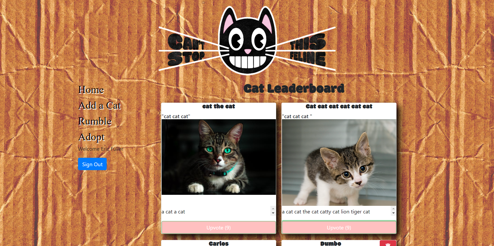
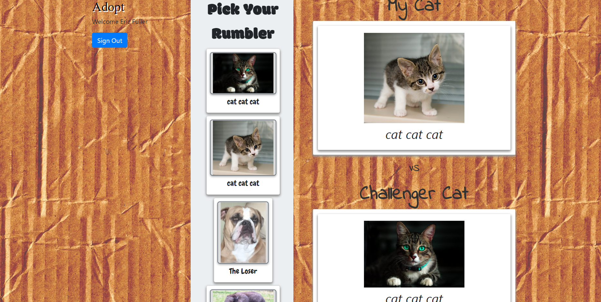
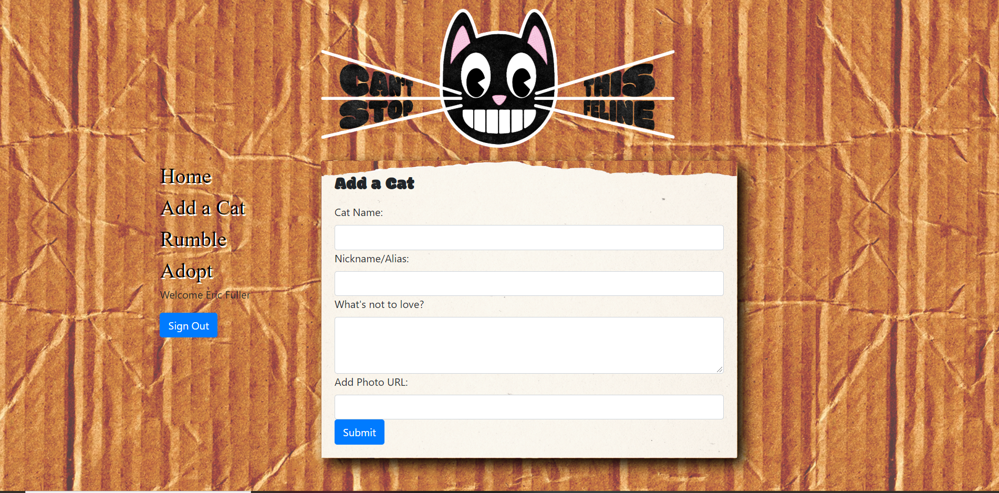

https://cant-stop-this-feline.herokuapp.com/

# Can't Stop this Feline

This application is like a social media site for cats, a place to play games with your cats and others' cats, and a place to find pet adoption centers in your area.

## Motivation

Animal shelters are overrun with abandoned and lost friends in need of a home.  There is no shortage of websites on the web to find these centers, but we felt they weren't getting enough traffic.

## App is made of of four pages

### Home 

Here the user can sign in with Google, view the gallery of cats that have been added by all users, add an upvote to cats that the user likes, and delete its own uploaded cats.

### Rumble

On the Rumble page you can choose a cat to battle with and the "computer" will choose a random opponent from the gallery.  We added our own cat-themed twist on the rock-paper-scissors game:
    - litter rocks = rock  
    - all claws = scissors   
    - paper bag attack = paper  

The winner gets a point added to their upvotes!   

### Add a Cat

When signed in, you can add your own cat.  You can link your cat here with a URL from imgur.com.

### Adopt

Here is the page that we hope gets the most traffic.  We hope the user finds a pet adoption center in their area and finds their new furry friend. 

### Tech Used

React, Bootstrap, CSS3, JavaScript, Firebase, Mongodb, oAuth, PetFinder API

### Credit

Jae Tran, Kadonna Knape, Rafael Samano, Eric Fuller
